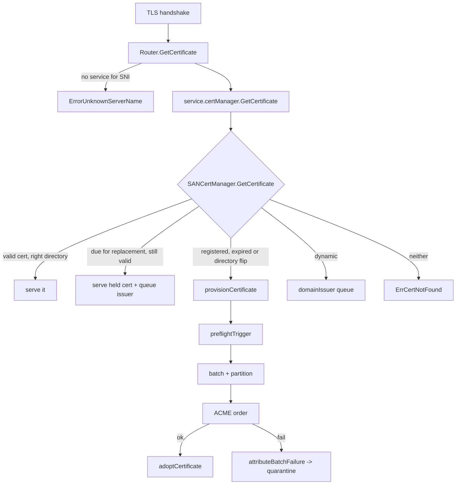

# Certificates: issuance, batching and renewal

The proxy has one ACME system when `--acme-email` is set: `SANCertManager`
(`internal/server/san_cert_manager.go`, 1030 lines). `internal/server/cert.go`
holds the `CertManager` interface (`GetCertificate` + `HTTPHandler`); three
types satisfy it — `SANCertManager`, `StaticCertManager`, and `autocert.Manager`
from `golang.org/x/crypto`.

`Service.createCertManager` (`internal/server/service.go:761-823`) picks one, in
this order, and the order is the contract:

1. clear this service's SAN directory override, whatever happens next
2. TLS disabled → no manager at all
3. both `--tls-certificate-path` and `--tls-private-key-path` → `StaticCertManager`
4. any host containing `*` → `ErrorAutomaticTLSDoesNotSupportWildcards`
5. a shared SAN manager exists **and** no `--tls-on-demand-url` → record the
   per-service directory, register every non-empty host, return the shared
   manager. An explicit on-demand URL is a per-service opt-in, so it wins.
6. otherwise an `autocert.Manager` over a `DirCache`, with either a host
   whitelist or the on-demand policy

`--tls-domains-source` without `--acme-email` warns at deploy and issues
nothing: step 5 is the only path that reaches dynamic issuance.

## Who may have a certificate

Two allowlists, both consulted before any order:

- `registeredDomains` — hosts named by `deploy --host` on a TLS service,
  installed by `Service.createCertManager` → `RegisterDomain`.
- `dynamicDomains` — hosts learned from a `--tls-domains-source` poll, installed
  by `SetDynamicDomains` (`internal/server/san_cert_dynamic.go`).

`GetCertificate` (`internal/server/san_cert_manager.go:430-512`) serves a
covering certificate that is more than 24h from expiry and issued at the right
directory. Otherwise: a still-valid certificate keeps serving while a
replacement is queued asynchronously — reaching the expiry window means
proactive renewal was already failing, and a handshake that errors with a valid
certificate in hand is a self-inflicted outage. The one exception is a
**registered** domain whose certificate came from a directory its service has
moved away from: that is fresh operator intent with a presumably healthy CA, so
the handshake reprovisions synchronously. Dynamic domains stay on the
serve-stale path even then, so one `--tls-staging` flip cannot fail every tenant
handshake at once. A name on neither list is refused outright.

## Batching a handshake order

`provisionCertificate` (`internal/server/san_cert_manager.go:525-672`):

1. `preflightTrigger` probes the triggering domain **before** taking any lock —
   a domain that cannot answer must cost nothing. Wildcards and domains in a
   zone with a DNS-01 provider are not probed, because neither needs to route
   here.
2. The single-flight key is `"service:" + owner`. Batches never span services,
   so a global slot would make one service's handshake wait out — and then
   spuriously fail after — another service's unrelated order.
3. Candidates are the triggering domain plus pending domains of the **same
   service and the same ACME directory**, skipping quarantined ones so they do
   not consume batch slots, up to `MaxSANsPerCertificate` (100).
4. `filterBatchMates` probes every non-trigger mate — history is not a pass, an
   expiring host whose DNS moved away must not ride in — and quarantines the
   unreachable ones. The trigger itself is never dropped.
5. `planIssuanceDomains` may collapse siblings into a wildcard
   (`DomainGrouper`, `--acme-prefer-wildcard`); the identifier set is sorted so
   `sanCertID` is stable.
6. `splitByProviderZone` narrows the order to one DNS-provider partition — one
   order never spans providers — and the deferred members go back to pending.
7. `bucket.Take` spends an ACME token. One `tokenBucket` serves every issuance
   path in the process (handshake, issuer, renewer), so they cannot add up past
   the limit.
8. Success: `adoptCertificate` + `clearBatchQuarantine`. Failure:
   `attributeBatchFailure` quarantines the identified culprits and restores the
   survivors to pending.

`adoptCertificateAt` takes `stateMu` then `mu`, publishes the maps, writes the
certificate files and persists the state under that one hold, so an export or a
concurrent persist can never capture state naming files that do not exist yet.

## Per-service ACME directories

`internal/server/san_cert_directories.go` carries the `--tls-staging` story.
`SetServiceDirectory` records a service's override — `createCertManager` clears
it first, on every path, so a service that stops using the shared manager cannot
leave one behind. `directoryForDomains` prefers concrete batch domains so a
synthesized wildcard inherits its originating service's directory rather than a
coverage scan; `wildcardOwnerLocked` resolves a wildcard only through domains
the certificate actually serves. `clientsForDirectory` lazily builds a client
bundle per directory behind `directoryInitMu` (it does network I/O and so cannot
ride `mu`), with account keys named by `accountFileForDirectory`:
`acme_user.json` for the run-level directory, `acme_user_staging.json` for
Let's Encrypt staging, `acme_user_<8 hex>.json` otherwise.

## Zones and providers

`internal/server/san_cert_zones.go` turns `--acme-dns-provider` entries into
obtainers. `ProviderSelection.ProviderFor` picks the longest matching zone
suffix, else the default; the matched zone doubles as the partition key that
keeps one order on one provider. `orderObtainer` refuses a batch whose members
resolve to different providers. `wildcardAnchors` and `outsideWildcardZones`
keep a wildcard order inside the zone its provider can answer for.

## Quarantine and release

`domainQuarantine` (`internal/server/domain_quarantine.go`) keeps a per-domain
failure count and a current hold, kinded `quarantinePreflight`, `quarantineACME`
or `quarantineRateLimited`. `RecordRateLimited` holds until the CA's advertised
time plus `rateLimitHoldMargin`; a zero or already-passed time falls back to the
ladder. `Release` lifts a hold but keeps the count, so a flapping domain keeps
climbing; `Clear` (successful issuance, or the domain left its source) drops the
history. A state file written before `Kind` existed decodes as
`quarantineACME`, the conservative default.

`releaseProber` (`internal/server/domain_release.go`) sweeps held domains on
`--acme-release-probe-interval` (default 1m, negative disables) and lifts the
hold from those that now route here. It deliberately records nothing on a
failing probe, and it excludes rate-limit holds and unprobeable domains in
`candidates` rather than leaving them to `probeDomains` — that function *skips*
them, so a sweep reading "not failed" as "passed" would release every wildcard
hold on its first tick.

## Asynchronous issuance

`domainIssuer` (`internal/server/domain_issuer.go`) drains a queue of dynamic
domains into orders under the shared token bucket and a concurrency cap.
`nextBatch` pops up to the service's batch size, all for one service, dropping
requests that became ineligible. `takePending`/`releasePending` let the renewer
top up an under-filled batch without racing a handshake into a duplicate order.

## Renewal

`certRenewer` (`internal/server/domain_renewal.go`) renews inside the ARI
suggested window when the server offers one, else at two-thirds of the
certificate's lifetime plus a per-certificate jitter — nothing assumes a 90-day
or 45-day era. `reconcile` retires certificates with no renewable domains,
renews the rest, and publishes `certificate_renewals_deferred` **only after a
completed pass**: a mid-loop `ctx.Err()` return skips the gauge rather than
publishing a partial count.

`renew` (`internal/server/domain_renewal.go:239-358`) defers rather than shrinks
while there is time — a shrunken identifier set both unmaps live members and
forfeits the identical-set renewal exemption — and compacts only inside
`compactionWindowFor`, which is a week earlier for certificates covering a
deploy-registered host, wildcards included. It then splits by desired directory
and by provider zone, issues one order per partition, and gives the ARI
`replaces` marker to at most one of them: the first partition still at the
certificate's **recorded** directory. The marker is spent when the CA accepts
the order, not when adoption succeeds — re-sending an identifier the CA already
honoured would have the next order rejected. An account-level rate limit breaks
only that directory's partition loop and holds its unsubmitted partitions until
the advertised time; another directory is a separate bucket and still proceeds.

## The other cert managers

- **Static** (`StaticCertManager`, `internal/server/cert.go`) — `--tls-certificate-path`
  plus `--tls-private-key-path`, loaded at deploy so a bad path fails there.
- **On-demand** (`internal/server/tls_on_demand.go`) — `--tls-on-demand-url`
  builds an `autocert.Manager` whose `HostPolicy` asks an endpoint whether a
  host may have a certificate. It beats the shared SAN manager for that
  service (step 5 above). A path-shaped URL is answered by the service's
  own handler chain through a `boundedResponseRecorder`; an absolute URL is
  fetched. Any 2xx approves (204 included); a redirect does not, because
  following it could turn a denial into an approval.

## Related

- `store-and-recovery.md` — export, verify, restore, and the Traefik/legacy importers
- `../dynamic-sources/summary.md` — where dynamic domains come from
- `../review/certs-issuance.md`, `../review/certs-directories-and-renewal.md`
